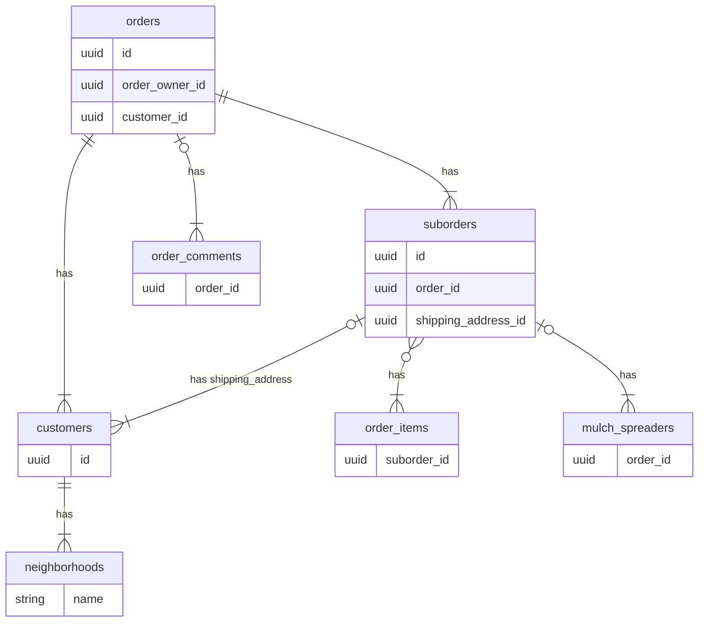
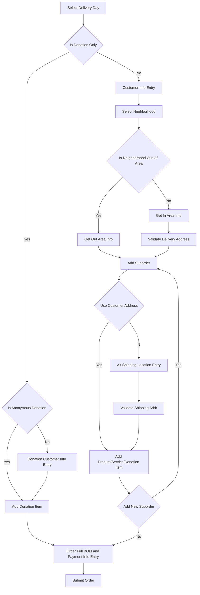
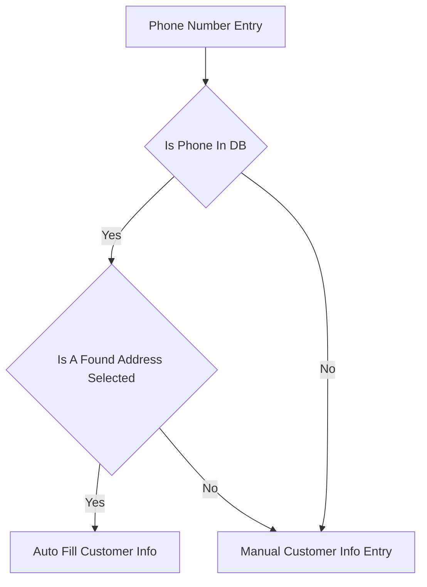

# T27 Fundraising Lambda

This is a bundle of functionality that is used by an AWS and CLI application to expose a GraphQL interface for the fundraiser db.

This is written in a modular way to allow for easy porting to Azure/GCP/Other if the time comes.


## Database SQL Schema

Enable PostGIS support for Postgresql based databases.  Requires 3.0.1 or above of PostGIS
```
CREATE EXTENSION postgis;
```

### Order Handling Related Tables

Table Connections


Order UI Flow


Retrieving Previous Customer Info


```
CREATE TABLE customers (id UUID PRIMARY KEY DEFAULT gen_random_uuid(), neighborhood STRING, address_id UUID, email STRING, phone STRING, name STRING);
```

Example of how to do multi insert with single value.
```
WITH CDB AS (
    INSERT INTO customers(x,y,z) VALUES ($1, $2, $3)
    RETURNING customer_id
    )
INSERT INTO mulch_orders(a, customer_id,b,c)
SELECT $4,CDB.customer_id,$5,$6 FROM CDB;
```

```
CREATE TABLE orders (order_id UUID PRIMARY KEY DEFAULT gen_random_uuid(), order_owner_id STRING, customer_id UUID,
                     cash_amount_collected DECIMAL(13, 4), check_amount_collected DECIMAL(13, 4), check_numbers STRING,
                     amount_from_donations DECIMAL(13, 4), amount_from_purchases DECIMAL(13, 4),
                     will_collect_money_later BOOL, total_amount_collected DECIMAL(13,4),
                     is_verified BOOL, last_modified_time TIMESTAMP, delivery_id INT);
```

```
CREATE TABLE suborders (id UUID PRIMARY KEY DEFAULT gen_random_uuid(), order_id UUID, alternative_shipping_address_id UUID, special_instructions STRING)
```

```
CREATE TABLE order_items (suborder_id UUID, product_id STRING, num_sold INT)
```

```
CREATE TABLE order_comments (timestamp TIMESTAMP, order_id UUID, comment STRING, PRIMARY KEY(timestamp, order_id));
```

```
CREATE TABLE mulch_spreaders (suborder_id UUID PRIMARY KEY, spreaders STRING []);
```


```
CREATE TABLE addresses (id UUID PRIMARY KEY DEFAULT gen_random_uuid(), addr STRING, resolved_addr STRING, zipcode INT, city STRING, geom GEOGRAPHY(POINT,4326), last_modified_time TIMESTAMP, created_time TIMESTAMP);
```


### Mulch Delivery Related Tables

```
CREATE TABLE mulch_delivery_timecards (uid STRING, delivery_id INT, last_modified_time TIMESTAMP, time_in TIME, time_out TIME, time_total TIME, PRIMARY KEY (uid, delivery_id, time_in));
```

### Fundraiser Configuration Tables

```
CREATE TABLE fundraiser_config (kind STRING PRIMARY KEY, description STRING, last_modified_time TIMESTAMP, is_locked BOOL, products JSONB, mulch_delivery_configs JSONB, finalization_data JSONB);
```

```
CREATE TABLE neighborhoods (name STRING PRIMARY KEY, zipcode INT, city STRING, distribution_loc STRING, is_visible BOOL, last_modified_time TIMESTAMP, meta JSONB);
```

```
CREATE TABLE users (id STRING, group_id STRING, first_name STRING, last_name STRING, created_time TIMESTAMP, last_modified_time TIMESTAMP, has_auth_creds BOOL);
```

```
CREATE TABLE allocation_summary (uid STRING PRIMARY KEY, bags_sold INT, bags_spread DECIMAL(13,4), delivery_minutes DECIMAL(13,4), total_donations DECIMAL(13,4), allocation_from_bags_sold DECIMAL(13,4), allocation_from_bags_spread DECIMAL(13,4), allocation_from_delivery DECIMAL(13,4), allocation_total DECIMAL(13,4));
```

